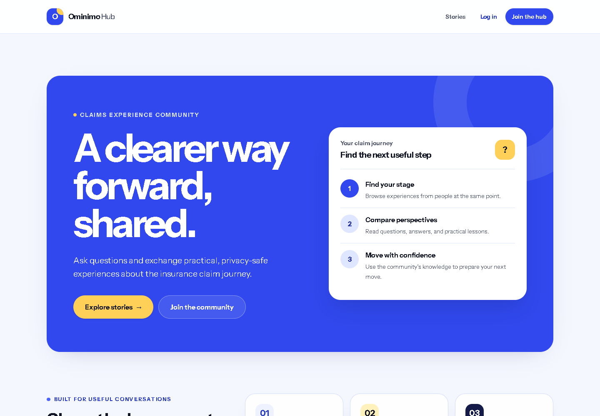

# Ominimo Claims Experience Hub

A Laravel 13 community blog for sharing privacy-safe experiences and questions about the insurance claim journey.

## About the project

Ominimo Claims Experience Hub was created for the Ominimo backend developer assignment. It develops the requested blog into a realistic community space where people can discuss the process around an insurance claim without publishing claim references, policy numbers, financial details, medical information, or other sensitive data.

The application gives users three clear ways to participate:

- **Explore the claim journey:** visitors can browse, search, and filter published stories by reporting, assessment, review, decision, payment, or closed stage.
- **Share experiences and questions:** registered members can create drafts, publish stories, manage their own posts, and participate in discussions; guests can also comment on published stories.
- **Keep discussions useful:** moderators can review posts and comments, while administrators can manage user roles and retain full moderation access.

This is a demonstration application. It does not submit or process insurance claims and is not connected to Ominimo's internal systems. All included users, stories, and comments are fictional demonstration data.

**[Open the complete application screenshot gallery](docs/SCREENSHOTS.md)** to see the public, mobile, login, moderation, and role-management views.

## User roles and main workflows

| Role | Main capabilities |
| --- | --- |
| Guest | Browse published stories, use search and filters, read active comments, and comment on published stories |
| User | Register, log in, manage a profile, create drafts, publish and edit owned posts, and manage owned comments |
| Moderator | Review all posts and comments, change content status, and moderate community discussions |
| Administrator | Use all moderation features and manage user roles while the final administrator remains protected |

Authorization is enforced on the server with Laravel policies and role middleware. The complete request and permission flow is described in [Architecture and limitations](docs/ARCHITECTURE.md#request-and-authorization-flow).

## Implemented functionality

### Accounts and authorization

- Registration, login, logout, profile updates, password changes, and account deletion
- User, moderator, and administrator roles
- Ownership checks for posts and comments
- Protected moderation and role-management routes
- Login and guest-comment rate limiting

### Posts and discovery

- Create, read, update, publish, unpublish, and delete posts
- Draft and published states with server-managed publication timestamps
- Claim-stage classification
- Full-text search on MySQL with a portable SQLite fallback for tests
- Filters for claim stage, author, activity, and visible publication status
- Database pagination with preserved filter values
- Eager loading, relationship counts, and indexes to avoid unnecessary queries

### Comments and moderation

- Comments from authenticated users and guests
- Active and hidden moderation states
- Ownership-based deletion for comment and post owners
- Moderator and administrator controls for all community content
- Escaped output and validation that rejects several high-confidence sensitive identifiers

### Images and background processing

- JPG, PNG, and WebP upload validation
- Private storage for original images
- Public WebP derivatives, auto-oriented and limited to 1600 pixels without upscaling
- Redis-backed image jobs processed and monitored by Laravel Horizon
- Safe retries, version checks, and cleanup when an image, post, or account is removed

The complete data model and asynchronous image sequence are available in the [architecture document](docs/ARCHITECTURE.md#image-processing-flow). The mapping between the original requirements and the completed work is recorded in the [project plan](docs/PROJECT_PLAN.md).

## Architecture at a glance

A typical request follows this path:

~~~text
Browser
  -> routes/web.php
  -> Controller
  -> Form Request validation and authorization
  -> Eloquent model and MySQL
  -> Blade view
  -> HTML response
~~~

The main data relationships are straightforward:

~~~text
User 1 ---- many Posts
Post 1 ---- many Comments
User 0..1 - many Comments
~~~

Each post has one author. A comment belongs to one post and may be anonymous when submitted by a guest. Deleting a user removes their posts and anonymizes their comments. The full entity-relationship diagram, indexes, security boundaries, and known limitations are documented in [Architecture and limitations](docs/ARCHITECTURE.md).

## Project structure

The following paths are the quickest way to find the main code:

~~~text
app/
|-- Enums/               Roles, claim stages, and content statuses
|-- Http/
|   |-- Controllers/     Authentication, posts, comments, profiles, and administration
|   |-- Middleware/      Role-based route protection
|   +-- Requests/        Validation and authorization of incoming data
|-- Jobs/                Queued post-image processing
|-- Models/              Eloquent models, relationships, and query scopes
|-- Policies/            Ownership and role-based permissions
|-- Rules/               Privacy-safe public content validation
+-- Services/            Image storage and cleanup

database/
|-- factories/           Test data factories
|-- migrations/          Database schema, foreign keys, and indexes
+-- seeders/              Fictional demo users, posts, and comments

resources/
|-- css/                 Tailwind styles
|-- js/                  Frontend JavaScript entry point
+-- views/                Blade pages and reusable components

routes/web.php            Web routes and middleware boundaries
tests/                    Unit and feature tests
compose.yaml              MySQL, Redis, and Horizon services
docs/                     Architecture, operations, project plan, and screenshots
~~~

## Technology choices

| Technology | Purpose in this project |
| --- | --- |
| PHP 8.4 and Laravel 13 | Application logic, routing, validation, authentication, authorization, and queues |
| Blade | Server-rendered pages and reusable interface components |
| MySQL 8.4 and Eloquent | Persistent users, posts, comments, relationships, indexes, and search |
| Redis 7 | Queue and cache storage |
| Laravel Horizon | Processing and monitoring background image jobs |
| Intervention Image and GD | Image orientation, resizing, and WebP encoding |
| Tailwind CSS and Vite | Responsive styling and frontend asset builds |
| Docker Compose | Local MySQL, Redis, and Horizon services |
| PHPUnit and Laravel Pint | Automated behavior tests and PHP style checks |

## Local setup

### Prerequisites

- PHP 8.4 with Composer and the Laravel-required extensions
- Node.js and npm
- Git
- Docker Desktop with Docker Compose

On native Windows, Horizon's Linux-only extensions are supplied by its Docker image. Install PHP dependencies with:

~~~powershell
composer install --ignore-platform-req=ext-pcntl --ignore-platform-req=ext-posix
~~~

On Linux or WSL, use composer install without the additional flags.

### First-time installation

From the repository root:

~~~powershell
Copy-Item .env.example .env
php artisan key:generate
docker compose up -d mysql redis
php artisan migrate --seed
php artisan storage:link
npm ci
npm run build
php artisan serve
~~~

The application is then available at http://localhost:8000.

In another terminal, build and start Horizon so uploaded images can be processed:

~~~powershell
docker compose --profile worker up -d --build horizon
~~~

For port configuration, Linux commands, scheduler requirements, queue troubleshooting, and common Windows notes, follow [Installation and operations](docs/OPERATIONS.md).

### Daily startup

After the first installation, start Docker Desktop and run:

~~~powershell
docker compose up -d mysql redis
docker compose --profile worker up -d horizon
php artisan serve
~~~

Keep the terminal running php artisan serve open while using the application.

## Demonstration data

Running php artisan migrate --seed creates:

- 3 demonstration accounts
- 4 posts: 3 published stories and 1 draft
- 4 comments: 3 active comments and 1 hidden moderation example

| Role | Email | Local password |
| --- | --- | --- |
| User | nikola.petrovic@example.com | !Nikola.p1 |
| Moderator | aleksa.jovanovic@example.com | !Aleksa.j2 |
| Administrator | bogdan.markovic@example.com | !Bogdan.m3 |

These credentials are intended only for the locally seeded demonstration environment. Do not use them in a deployed application. The screenshots were captured from an isolated seeded database; details are provided in [Application screenshots](docs/SCREENSHOTS.md).

## Testing and quality

The project includes 105 automated tests with 462 assertions covering authentication, authorization, posts, comments, moderation, search, image processing, and seed data.

Run the complete verification suite with:

~~~powershell
php artisan test
vendor/bin/pint --test
npm run build
composer validate --strict --no-check-publish
docker compose --profile worker config --quiet
~~~

Tests use an in-memory SQLite database and do not change the configured MySQL data. Deployment-specific checks and useful diagnostic commands are listed in the [verification section of the operations guide](docs/OPERATIONS.md#verification).

## Additional documentation

- **[Architecture and limitations](docs/ARCHITECTURE.md)** explains the data model, authorization flow, image processing, security boundaries, and limitations.
- **[Installation and operations](docs/OPERATIONS.md)** provides setup, daily-use, queue, and verification instructions.
- **[Application screenshots](docs/SCREENSHOTS.md)** shows the public, mobile, login, moderation, and role-management interfaces.
- **[Project plan](docs/PROJECT_PLAN.md)** maps the assignment requirements to the completed implementation phases.
