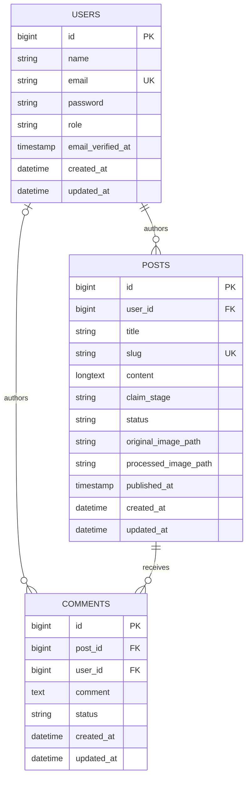

# Architecture and limitations

## Entity-relationship diagram

The diagram shows application data. Laravel's framework tables for sessions, cache, and queue jobs are omitted.

Each post has exactly one author. A comment belongs to one post and may have no user: guest comments are anonymous, and deleting a member account nulls their comment author. Deleting a post cascades to its comments; deleting a user cascades to their posts. Image paths are stored on posts, while the files live on separate private-original and public-derivative disks.

## Request and authorization flow

- Laravel session authentication identifies members. Role middleware protects the moderation workspace; policies enforce ownership, moderation, visibility, and role changes on the server.
- Dedicated Form Requests authorize and validate writes and searches. Shared search normalization trims filter inputs before validation.
- Enums cast role, claim stage, publication status, and comment status. The server generates slugs and publication timestamps rather than trusting submitted values.
- Guests can read published posts and active comments and can comment on published posts. Authors can see their drafts and hidden comments; post owners can see comments on their posts. Moderators and administrators can review all content. Only administrators can change other users' roles; self-demotion and removal of the final administrator are blocked.
- Public and admin listings paginate database queries. Post visibility/search scopes, eager loading, relationship counts, and indexes keep the views bounded and avoid N+1 loading. MySQL uses a full-text index for eligible post searches; SQLite tests use a portable `LIKE` fallback.

## Image-processing flow

1. A Form Request validates image type, size, and dimensions.
2. The original upload is stored privately under a server-generated name.
3. The post is saved in a database transaction; `ProcessPostImage` is dispatched after commit.
4. Redis holds the `images` queue, and Horizon processes it. The job creates a public WebP derivative, updates the post only if the original path still matches, and safely handles retries or stale work.
5. Replacing/removing an image or deleting its post/account removes obsolete files. The scheduler snapshots Horizon metrics.

## Security and operating boundaries

- This is a discussion hub, not a claims-submission, payment, or document-vault system. It must not contain real claim numbers, financial details, or other sensitive insurance information.
- The `SafePublicContent` rule catches several high-confidence identifiers, but pattern matching cannot guarantee that all personal or sensitive text is detected. Moderation and user guidance remain necessary.
- Guest comments have no account identity; rate limiting reduces abuse but is not a substitute for moderation.
- Seeded accounts use published example credentials for local demonstration only. Do not seed them into a public environment; provision and rotate production administrator credentials separately.
- Email verification, a notification workflow, and automated end-to-end browser tests are not implemented.
- Automated tests use in-memory SQLite, storage/queue fakes, and isolated services. They do not replace a deployment smoke test of MySQL full-text behavior, Redis/Horizon processing, filesystem permissions, and public storage links.
