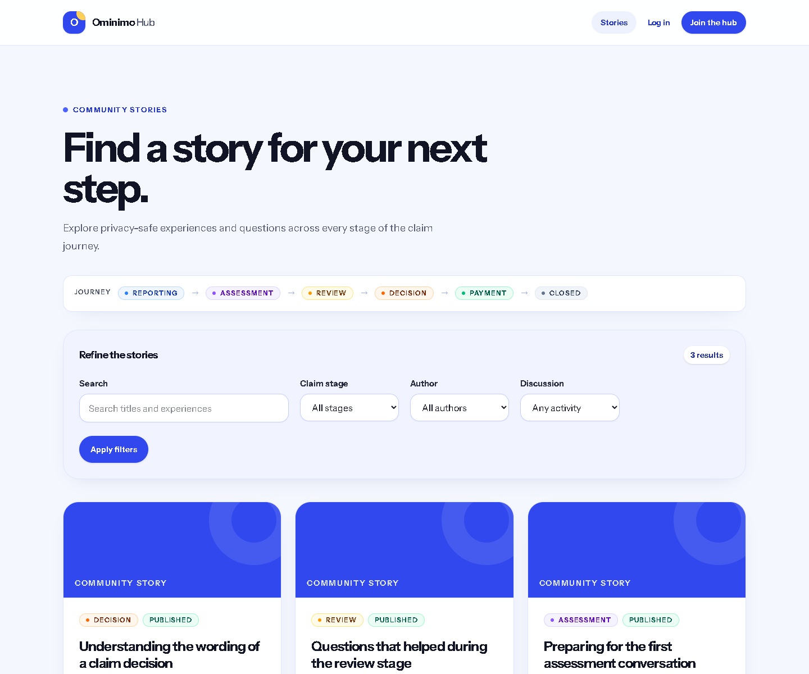
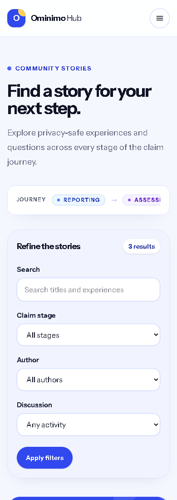
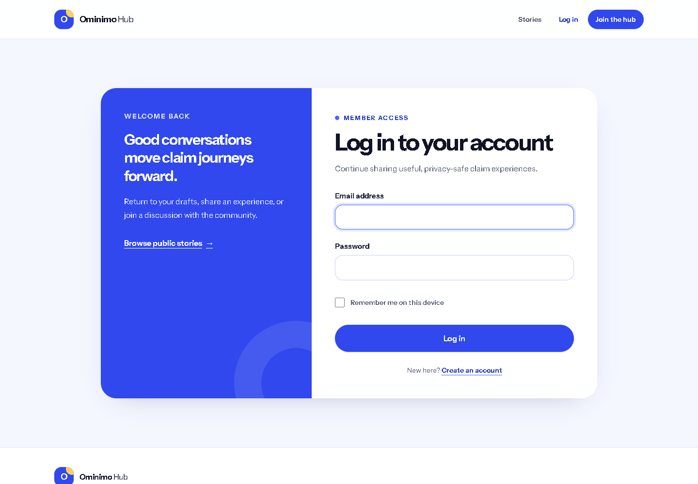
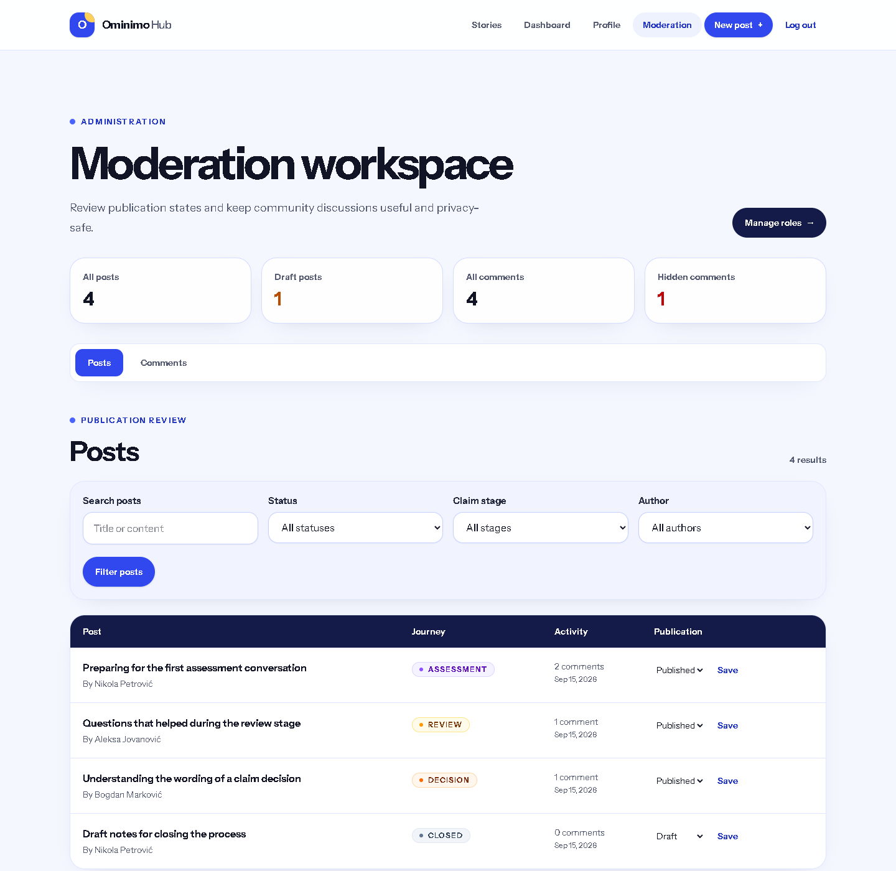
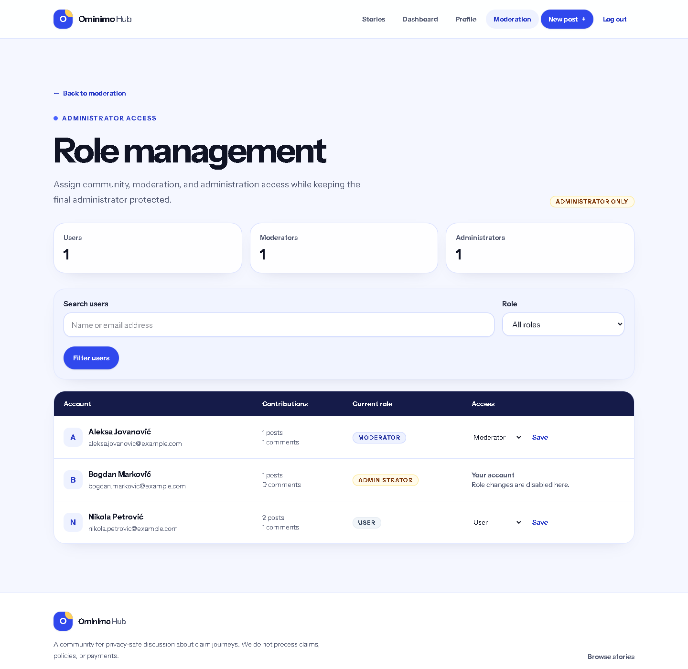

# Application screenshots

Captured on 15 September 2026 from the running Laravel application with the production frontend build and an isolated, freshly seeded SQLite preview database. All visible names and email addresses are demonstration data; no real claim details are shown.

## Public experience

Desktop home page:

Desktop story listing and filters:

390px mobile story listing (the journey strip scrolls horizontally):

Login screen:

## Administration

Administrator moderation workspace:

Administrator-only role management:

